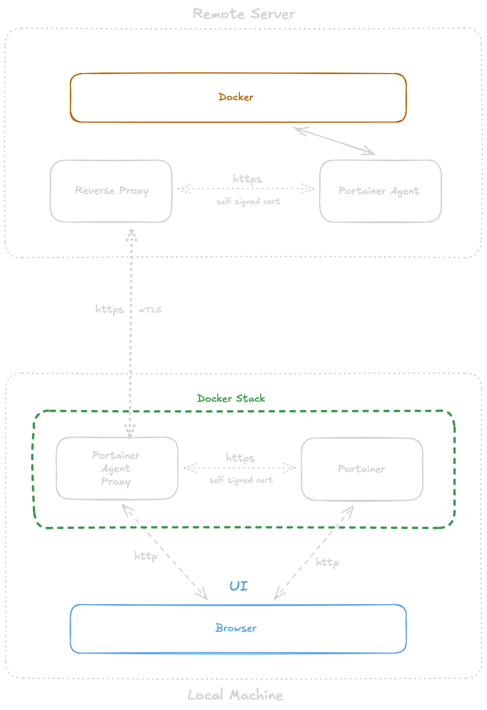
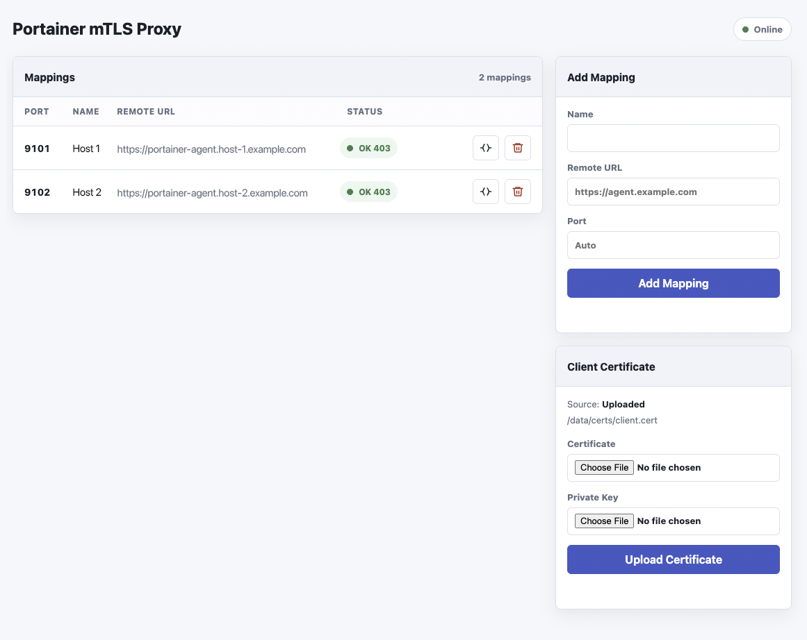

# Portainer Agent Proxy

A proxy to connect a local Portainer instance to remote Portainer Agent instances behind a reverse proxy, protecting the agents with mTLS (client cert).

## Why I created this

I prefer to run my Portainer instance locally on my developer machine and would like to manage the Docker instances on all my servers from there. But having Docker Agent accessible over the internet on my remote servers doesn't feel comfortable. I wanted to hide the Portainer agent behind a reverse proxy that requires mTLS for connecting. Unfortunately, Portainer does not support this, at least not in the Community Edition.

So I created this Portainer Agent Proxy that runs in the same Docker stack as my local Portainer and pipes the connections through to the remote agents, establishing the mTLS client certificate.

<p align="center" style="margin-bottom: 50px;">
    <br />
    <i>Components of the infrastructure in which the Portainer Agent Proxy can be used. </i>
</p>

## WebUI

The agent exports one port for the web UI to configure the mappings to the remote server. It automatically adds ports for each mapping that Portainer can connect to. The WebUI can be used to manage the mappings for several remote Portainer agents and to manage the mTLS certificate and key. 

<p align="center">
    <br />
    <i>The Portainer Agent Proxy management UI.</i>
</p>


## Image

The release image is published to GitHub Container Registry:

```text
ghcr.io/jdeepwell/portainer-agent-proxy:latest
```

Version tags are also supported when Git tags like `v0.1.2` are pushed.

## Compose Usage

Add the proxy to the same Docker network as Portainer CE. The management UI is bound to localhost only; agent proxy ports in the `91xx` range are only reachable inside the Docker network.

```yaml
services:
  portainer:
    image: portainer/portainer-ce:latest
    container_name: portainer
    restart: unless-stopped
    ports:
      - "127.0.0.1:9000:9000"
    volumes:
      - portainer_data:/data
    networks:
      - portainer_net

  portainer_agent:
    image: portainer/agent:latest
    container_name: portainer_agent_local
    restart: unless-stopped
    volumes:
      - /var/run/docker.sock:/var/run/docker.sock
      - /var/lib/docker/volumes:/var/lib/docker/volumes
    networks:
      - portainer_net

  portainer_mtls_proxy:
    image: ghcr.io/jdeepwell/portainer-agent-proxy:latest
    container_name: portainer_mtls_proxy
    restart: unless-stopped
    ports:
      - "127.0.0.1:9200:9200"
    volumes:
      - proxy_data:/data
      # Optional fallback when not using the UI certificate upload:
      # - /absolute/path/to/certs:/certs:ro
    networks:
      - portainer_net

volumes:
  portainer_data:
  proxy_data:

networks:
  portainer_net:
    driver: bridge
```

An editable example is available in `compose.example.yml`.

## Mapping Configuration

The mapping configuration is stored directly as managed nginx config files in the persistent `/data` volume:

```text
/data/nginx/conf.d/9101.conf
/data/nginx/conf.d/9102.conf
```

The management UI reads these files to display current mappings, and the privileged agent validates and writes them when mappings are added or removed. So the nginx configuration files are the single source of truth, and there are no redundant configuration files or database entries. Editing those nginx configuration files manually can lead to issues because the parser in the agent is kept deliberately simple. 

## Proxy HTTPS Certificate

Portainer talks to Agent endpoints over HTTPS. The proxy therefore listens with HTTPS on every configured `91xx` mapping port.

On first startup the container generates a self-signed server certificate and key at:

```text
/data/server-certs/proxy.crt
/data/server-certs/proxy.key
```

These files are stored in the persistent `/data` volume and are reused across container restarts and image upgrades. To use your own certificate, place a matching PEM certificate and unencrypted private key at those same paths before starting the container.

The generated certificate includes SANs for `portainer_mtls_proxy`, `localhost`, and `127.0.0.1`. If Portainer will connect using another Docker service alias or hostname, add extra SAN entries with `PROXY_TLS_SAN`:

```yaml
environment:
  PROXY_TLS_SAN: "DNS:my_proxy_alias,DNS:agent-proxy.local"
```

## Client Certificate

Open the management UI at:

```text
http://127.0.0.1:9200/
```

Upload the global client certificate and private key for the connection to the Reverse Proxy on the remote server via the UI. They are stored in the persistent `/data` volume:

```text
/data/certs/client.cert
/data/certs/client.key
```

If you prefer mounting files instead of uploading them, mount a directory containing `client.cert` and `client.key` at `/certs:ro`; uploaded files in `/data/certs` take precedence when present.

## Portainer Environment URLs

After adding mappings in the UI, configure Portainer Agent environments using the proxy service name and internal mapping ports as endpoints, for example:

```text
portainer_mtls_proxy:9101
```

**IMPORTANT:** Do not publish `91xx` ports on the host. They are intended for Portainer-to-proxy HTTPS traffic inside the shared Docker network.
